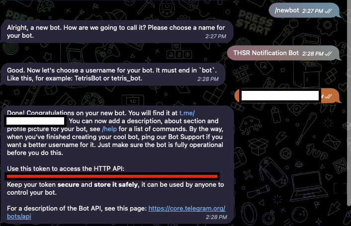
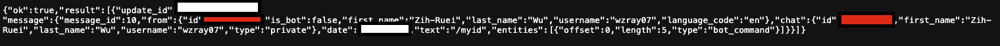
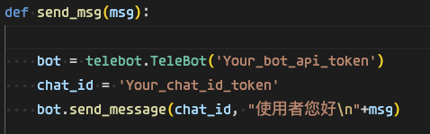
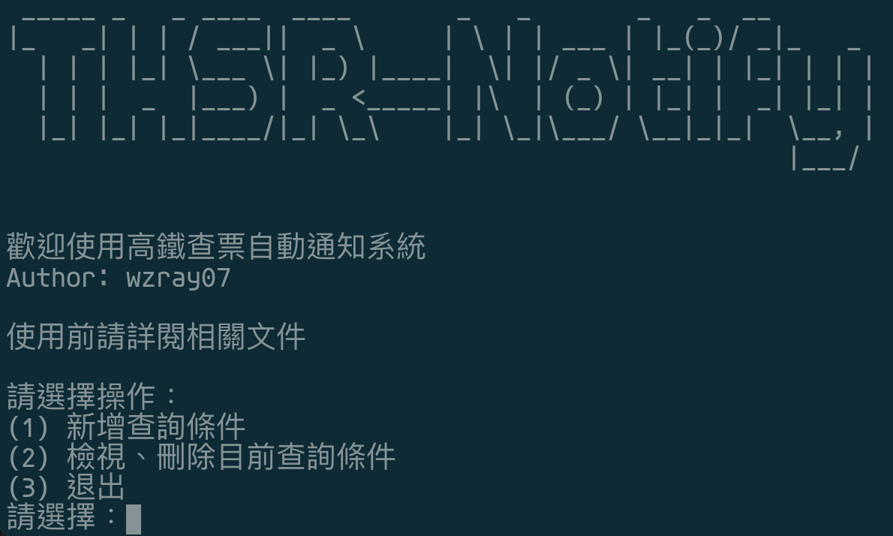

###### tags: `高鐵` `爬蟲` `高鐵爬蟲`
# THSR_notify

## Introduce 
- 這是一個能夠幫你快速刷高鐵票的爬蟲程式
- 利用 selenium 套件能夠更快速地刷票
    - 高鐵訂票網站有文字驗證碼需填寫，所以無法使用 request 的方式進行爬蟲
- 搭配自動排程執行 (ex. crontab) 或是常駐的執行能夠更有效率的找票
## Environment
- `Python` Version >= 3.10
- `pip3`
## How to use
### Setting
- use in terminal
- `cd THSR_notify`
- 安裝必要套件
    - `pip3 install -r requirements.txt`
- Telegram Bot
    - 找機器人爸爸申請一個 Bot
    - [連結](https://telegram.me/BotFather)
    - 輸入 `/newbot`
    - 接著輸入名稱
    - 之後再輸入 `username`
        - 結尾要有 `bot` or `Bot` 字樣
    - 
    - 之後你就會取得與機器人的聊天室連結與 Token
    > 務必保管好
    - 開啟瀏覽器，進入`https://api.telegram.org/bot{Your_api_token}/getUpdates`
    > {Your_api_token} 請替換成你剛剛取得的 Token，括號不用保留
    - 你會看到 `{"ok":true,"result":[]}` 字樣
    - 之後至你剛剛新增的 bot 機器人的聊天室輸入 `/myid`
    - 到剛剛的頁面重新整理一次
    - 
    - 會跳出更多資訊，紅色區域為你與機器人的聊天室 id token
    > 一樣請保管好
    - 打開 `bot.py` 這個檔案
    - 
    - 把 `Your_bot_api_token` 替換成一開始拿到的機器人 token
    - 把 `Your_chat_id_token` 替換成後面去瀏覽器拿到的 chat token
    - 存檔後即可使用

- 查票條件介面
    - `python3 main.py`
- 測試爬蟲
    - `python3 climb.py`
- 自動排程執行 (Linux based)
    - `crontab -e`
    - 選擇編輯器
    - 加上 crontab 語法 (Ex. `*/10 * * * * python3 /[PATH]/THSR_notify/climb.py`)
    - [使用參考](https://crontab.guru/)
## Function
### V1.0
#### 介面
- Terminal 執行時能夠更方便建立查詢條件
- 
    - 建立的查詢條件以 `json` 存檔
    - 更方便的查詢與刪除目前使用者新增的條件
> 目前無檢查輸入的功能，需注意文字是否有輸入錯誤以防無法順利執行爬蟲
#### 爬蟲
- 皆使用免費開源的套件
- 文字驗證碼使用 Ddddocr 套件，易出錯
    - 自動重新刷新網站重新填寫資料
- 能找出區間中最早出發的班次，並顯示出發時間
#### 日誌功能
- 日誌能夠紀錄新增、刪除條件的 timestamp
- 執行一次爬蟲過後能夠紀錄此筆查詢的最終結果

### 未來更新功能
#### 近期 
- telegram bot 互動功能
- mail 自動通知功能
- 常駐程式版本
#### 遠期
- 時間班次匹配更精確
    - 挑選時程最快的班次
- 自動訂票功能
- 自動檢查輸入錯誤
- 更人性化一點（Ex. GUI, 網頁）

## Other
- 如有任何使用上的問題 or 建議 or 指教，歡迎直接 mail 給我與我溝通！如發現 code 的部分有問題也歡迎直接發 issue
- 如果喜歡也別吝嗇點個 Star !
- Mail : dtjfhjtf@gmail.com